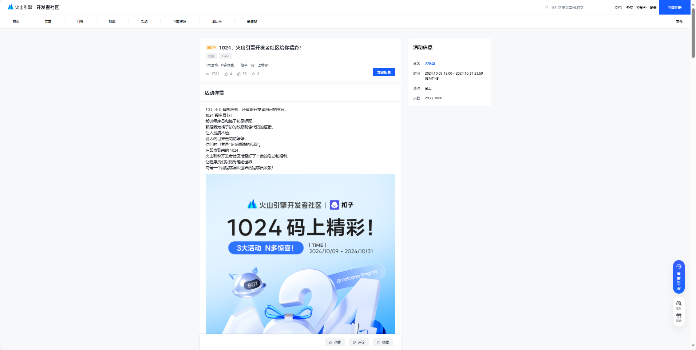
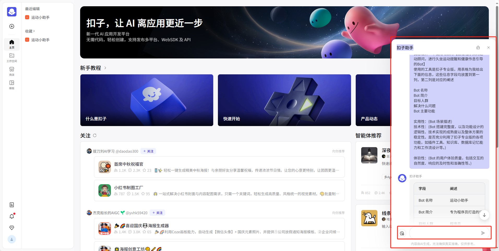

# 大模型Bot应用开发🔯(初级版)

***

## 学习参考

比赛报名地址：[赛事报名](https://zjsms.com/iBupcaYC/)

 赛事说明：大模型Bot应用开发赛事是基于“Prompt工程、工作流、图像流”进行创新应用设计的赛事，需要以“程序员智能搭子 ”为主体进行开发，技术上依赖于“扣子(COZE)”平台快速搭建AI应用。

## Task01 创建自己的AI应用

首先介绍一下完成此次AI应用我所使用的工具：

> 豆包：[豆包 (doubao.com)](https://www.doubao.com/chat/)
>
> 扣子：[主页 - 扣子 (coze.cn)](https://www.coze.cn/home)

首先基于豆包对所要进行设计的AI应用进行提问，从中获取灵感，我的提问过程如下：

> 回合一：
>
> >Q：现如今的程序员都需要什么类型的搭子
> >
> >A：现如今的程序员可能需要以下几种类型的搭子：
> >
> >1. 技术互补型搭子
> >   - **前端与后端搭子**：如果是前端程序员，那么与后端程序员搭档会很有帮助。前端主要负责用户界面的设计和交互，而后端负责服务器端的逻辑处理和数据存储。两者相互配合，能更好地完成一个完整的项目。比如在开发电商网站时，前端搭子负责打造美观、流畅的购物页面，后端搭子则确保用户的订单数据准确无误地存储和处理。
> >   - **算法与工程实现搭子**：算法工程师擅长设计高效的算法，而程序员负责将这些算法转化为实际可运行的代码。在人工智能、大数据等领域，这种搭配尤为重要。例如在开发图像识别软件时，算法搭子设计出能够准确识别图像的算法，程序员搭子则将其实现为一个可供用户使用的应用程序。
> >2. 学习交流型搭子
> >   - **同语言或框架爱好者搭子**：共同学习和交流某一种编程语言或框架的搭子很有价值。比如都是 Python 程序员，或者都在研究 Vue.js 框架，大家可以分享学习心得、遇到的问题及解决方案，互相促进提高。例如一起学习新的 Python 库的使用方法，或者探讨如何优化 Vue.js 应用的性能。
> >   - **AI 技术探索搭子**：随着人工智能技术的发展，与对 AI 感兴趣的人组成搭子，共同探索如何将 AI 技术应用到编程中，可以提升工作效率和创新能力。比如一起研究如何使用 AI 代码助手来辅助开发，或者利用 AI 生成代码的基础上进行优化和改进。
> >3. 项目协作型搭子
> >   - **测试搭子**：测试人员可以作为程序员的搭子，在项目开发过程中及时发现代码中的问题和漏洞。测试搭子能够从用户的角度出发，对程序进行各种场景的测试，帮助程序员提高代码质量。例如在游戏开发中，程序员编写游戏逻辑代码，测试搭子则负责测试游戏的可玩性、稳定性等方面。
> >   - **产品经理搭子**：产品经理了解用户需求和市场趋势，能够为程序员提供项目的方向和需求。与产品经理搭子紧密合作，程序员可以更好地理解项目的目标和意义，开发出更符合用户需求的产品。比如在开发一款移动办公应用时，产品经理搭子明确用户对于办公功能的需求，程序员搭子则根据这些需求进行功能开发。
> >4. 工作氛围型搭子
> >   - **摸鱼搭子**：在高强度的工作压力下，偶尔也需要放松。摸鱼搭子可以在工作之余一起聊天、吐槽，缓解工作压力，但要注意不能过度影响工作。
> >   - **运动搭子**：程序员工作往往长时间坐着，缺乏运动。有一个热爱运动的搭子，可以一起在下班后跑步、健身、打球等，保持身体健康，也能增进彼此之间的友谊。

此时我就发现了令我比较感兴趣的AI应用：**运动搭子**，于是继续进一步提问细化。

> 回合二：
>
> > Q：请继续详细阐述“运动搭子”，可以从搭子功能、及参考案例等角度出发分析
> >
> > A：**一、运动搭子的功能**
> >
> > 1. **促进健康**
> >    - 程序员的工作性质决定了他们长时间坐在电脑前，缺乏运动，容易出现各种健康问题，如颈椎病、腰椎病、肥胖等。运动搭子可以督促彼此定期进行运动，如跑步、健身、打球等，提高身体素质，预防疾病。
> >    - 一起制定运动计划，互相鼓励坚持下去。例如，每周安排几次跑步或健身活动，互相监督完成目标。在运动过程中，还可以交流健康知识和养生方法，共同提高健康意识。
> > 2. **缓解压力**
> >    - 程序员的工作压力通常较大，需要一个出口来释放压力。运动是一种很好的减压方式，而运动搭子可以让这个过程更加愉快和有效。
> >    - 一起参加激烈的运动项目，如篮球、足球等，在运动中尽情释放压力和负面情绪。或者选择一些放松的运动，如瑜伽、散步等，在宁静的氛围中舒缓身心。运动后，还可以分享彼此的感受和心得，进一步缓解压力。
> > 3. **增强团队合作和沟通能力**
> >    - 虽然运动搭子不一定是工作中的同事，但通过一起运动，可以培养团队合作精神和沟通能力。在运动中，需要互相配合、互相支持，这与工作中的团队合作有相似之处。
> >    - 例如，在参加团队运动项目时，需要制定战术、分工合作，这可以锻炼沟通和协调能力。同时，运动中的互动也可以增进彼此之间的了解和信任，为工作中的合作打下良好的基础。
> > 4. **丰富生活**
> >    - 运动搭子可以一起探索新的运动项目和场所，丰富生活内容。除了传统的运动项目，还可以尝试一些新颖的运动，如攀岩、骑行、游泳等。
> >    - 一起去不同的运动场所，如公园、健身房、体育馆等，体验不同的环境和氛围。这不仅可以增加运动的乐趣，还可以拓展社交圈子，认识更多志同道合的人。
> >
> > **二、参考案例**
> >
> > 1. 小明和小张是程序员同事，他们发现自己长时间坐在办公室，身体越来越差，于是决定一起运动。他们选择了跑步作为主要的运动方式，每周安排三次跑步活动。在跑步过程中，他们互相鼓励、互相监督，逐渐养成了运动的习惯。几个月后，他们的身体状况明显改善，工作效率也提高了。
> > 2. 小李是一名程序员，他通过社交软件认识了一位同样热爱运动的朋友小王。他们一起参加了一个瑜伽工作室的课程，在瑜伽的练习中，他们学会了放松身心、调节呼吸。课后，他们还会交流瑜伽的心得和体会，分享生活中的点滴。通过与小王的交往，小李不仅改善了身体状况，还收获了一份真挚的友谊。
> > 3. 小赵和小孙是两个程序员团队的负责人，他们意识到团队成员的健康问题对工作效率有很大影响。于是，他们组织了两个团队的成员一起参加篮球比赛。在比赛中，大家互相配合、互相支持，增强了团队凝聚力。同时，通过运动，大家也释放了工作压力，提高了工作积极性。此后，他们定期组织各种运动活动，让团队成员在工作之余能够保持健康的生活方式。

此时已经得到了相对完善的应用功能描述，然后就可以尝试按照构建Bot智能体的方式对其进行针对性的提问。

> 回合三：
>
> > Q：“为广大程序员群体设计一款满足其运动提醒、压力测试和健康知识分享需求的智能搭子” 基于这个方向，进行【搭子说明书】的写作，注意使用表格进行写作，另外，要考虑扣子开发平台的局限性，进行写作和设计，这个平台可以通过Prompt工程、工作流、图像流等功能进行 对话Bot应用开发
> >
> > A：
> >
> > | 分类         | 具体内容                                                     |
> > | ------------ | ------------------------------------------------------------ |
> > | Bot 名称     | “程序员活力助手”                                             |
> > | Bot 简介     | 一款专门为程序员打造的智能搭子，通过运动提醒、压力测试和健康知识分享，帮助程序员保持良好的身心状态。 |
> > | 目标人群     | 程序员群体。                                                 |
> > | 解决什么问题 | 解决程序员因工作忙碌而容易忽视运动、难以准确评估自身压力状况以及缺乏系统健康知识的问题。 |
> > | Bot 主要功能 | - **运动提醒**：根据程序员的工作时间和作息习惯，制定个性化的运动提醒计划，确保程序员能够定期进行适量运动。例如，在程序员连续工作一段时间后，自动弹出提醒窗口，鼓励其起身活动几分钟。 - **压力测试**：提供简单有效的压力测试方法，帮助程序员了解自己的压力水平。可以通过问卷调查、心理测试等方式进行，根据测试结果给出相应的建议和缓解方法。 - **健康知识分享**：定期推送与程序员工作和生活相关的健康知识，包括如何预防职业病、合理饮食搭配、有效的放松技巧等。 |
> > | 实用性       | - **场景描述**：程序员小王在忙碌的工作中经常忘记运动，自从使用了 “程序员活力助手”，每天都会收到定时的运动提醒，让他能够合理安排工作和运动时间。同时，小王通过压力测试了解到自己近期压力较大，根据 Bot 给出的建议进行了调整，如尝试冥想、深呼吸等放松方法。此外，小王还从 Bot 推送的健康知识中学习到了很多实用的养生技巧。 - **考虑扣子开发平台局限性**：在设计过程中，充分考虑扣子开发平台的局限性，尽量简化 Prompt 工程的复杂度，确保工作流的顺畅性。对于图像流功能，根据实际需求进行适度运用，避免过度依赖图像而导致加载缓慢等问题。例如，在压力测试结果的呈现上，可以采用简洁的文字描述和图表相结合的方式，而不是过多地依赖图像展示。 |
> > | 技术性       | - **搭建完整度**：在扣子开发平台上，尽可能完善 Bot 的功能模块，确保运动提醒、压力测试和健康知识分享等功能都能够稳定运行。 - **功能设计逻辑性**：各个功能之间相互关联，形成一个有机的整体。例如，压力测试结果可以作为运动提醒频率和强度调整的依据，健康知识分享也可以根据程序员的压力水平和运动需求进行个性化推送。 - **技术实现成熟度**：利用扣子开发平台提供的成熟技术，确保 Bot 的稳定性和可靠性。对于运动提醒功能，可以通过与程序员常用的开发工具或办公软件进行集成，实现更加便捷的提醒方式。 - **整体方案稳定性**：在开发过程中，进行充分的测试和优化，确保 Bot 在不同的使用场景下都能够稳定运行。考虑到程序员可能在不同的操作系统和设备上使用 Bot，进行兼容性测试，保证其在各种环境下都能正常工作。 |
> > | 体验性       | - **交互自然度**：通过优化 Prompt 工程，使程序员与 Bot 的交互更加自然流畅。采用简洁明了的语言风格，避免使用过于复杂的技术术语，让程序员能够轻松理解和使用 Bot。 - **响应及时性**：优化工作流，确保 Bot 能够及时响应用户的请求。对于运动提醒和压力测试等功能，尽量做到实时响应，提高用户体验。 - **准确性**：在健康知识分享和压力测试结果分析等方面，确保提供准确的信息和建议。通过查阅权威的医学资料和专业的心理测试方法，为程序员提供可靠的服务。 |

可以看到此时**豆包**已经帮我们生成了较为完整和详细的Bot智能体设计方案设计，我们也可以基于回答进一步针对性细化

> 回合四：
>
> > Q：设计一个使用场景为【担任程序员的运动顾问，进行运动提醒和健康作息引导】 使用的工具是扣子专业版，用表格为我给出下面的信息，这些信息字段均放置到第一列，第二列是对应的阐述 Bot 名称 Bot 简介 目标人群 解决什么问题 Bot 主要功能 实用性：(Bot 场景描述) 技术性：(Bot 搭建完整度，以及功能设计的逻辑性、技术实现的成熟度以及整体方案的稳定性。是否充分利用了扣子专业版的各项功能，如插件工具、知识库、数据库记忆能力和工作流设计等。) 体验性：(Bot 的用户体验质量，包括交互的自然度、响应的及时性和准确性等。)
> >
> > A：
> >
> > | 分类         | 具体内容                                                     |
> > | ------------ | ------------------------------------------------------------ |
> > | Bot 名称     | “编程活力指南”                                               |
> > | Bot 简介     | 一款专为程序员打造的运动顾问 Bot，提供运动提醒和健康作息引导服务。 |
> > | 目标人群     | 程序员群体。                                                 |
> > | 解决什么问题 | 解决程序员因长时间专注工作而忽视运动和健康作息的问题，帮助他们养成良好的生活习惯，提高身体素质。 |
> > | Bot 主要功能 | - **运动提醒**：根据程序员的工作时间和个人习惯，制定个性化的运动提醒计划。例如，在程序员连续工作一段时间后，发送提醒消息，鼓励他们起身活动、做一些简单的伸展运动。 - **健康作息引导**：提供合理的作息时间建议，包括睡眠时间、饮食规律等，帮助程序员调整生活节奏，提高工作效率。 |
> > | 实用性       | - **场景描述**：程序员小张经常长时间坐在电脑前工作，忘记运动和休息。自从使用了 “编程活力指南”，每天都会收到定时的运动提醒，让他能够及时起身活动一下身体。同时，Bot 还会根据他的工作情况，提供一些健康作息的建议，如合理安排午休时间、避免熬夜等。小张按照 Bot 的建议调整了自己的生活习惯，感觉身体状态和工作效率都有了明显提高。 - **充分利用扣子专业版功能**：利用插件工具接入健康监测设备，实时了解程序员的身体状况；知识库中存储丰富的运动和健康知识，为程序员提供专业的建议；数据库记忆能力可以记住程序员的运动习惯和作息时间，以便更好地制定个性化服务；工作流设计合理，确保运动提醒和健康作息引导的及时性和准确性。 |
> > | 技术性       | - **搭建完整度**：在扣子专业版上构建完善的功能模块，包括运动提醒、健康作息引导、数据记录和分析等，确保 Bot 能够满足程序员的需求。 - **功能设计逻辑性**：运动提醒和健康作息引导相互配合，共同促进程序员的健康。例如，根据程序员的作息时间安排运动提醒，确保运动不会影响工作和休息。 - **技术实现成熟度**：采用稳定可靠的技术实现方案，确保 Bot 的运行稳定。例如，利用可靠的消息推送服务，确保运动提醒能够及时送达。 - **整体方案稳定性**：经过充分的测试和优化，确保 Bot 在各种情况下都能稳定运行。考虑到程序员可能在不同的工作环境和设备上使用 Bot，进行兼容性测试，保证其在各种场景下都能正常工作。 |
> > | 体验性       | - **交互自然度**：通过优化对话界面和语言表达，使程序员与 Bot 的交互更加自然流畅。采用简洁明了的语言，避免使用过于复杂的术语，让程序员能够轻松理解和使用 Bot。 - **响应及时性**：确保 Bot 能够及时响应程序员的请求和反馈。例如，当程序员询问关于运动或健康作息的问题时，Bot 能够迅速给出准确的回答。 - **准确性**：提供准确的运动提醒和健康作息建议。通过专业的知识和数据分析，为程序员提供科学合理的指导。 |

至此，通过四个回合的问答，已经获得了符合我预期的**运动搭子**的要求，可以开始在**扣子平台**搭建AI应用了：

搭建好后的AI应用在：[运动小助手 - 扣子 AI 智能体 (coze.cn)](https://www.coze.cn/store/agent/7424120573573480488?bid=6e1u9ari4200r&panel=1)，欢迎大家体验~。

